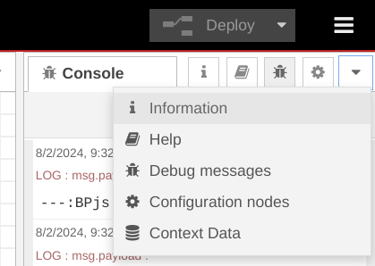

# BPFlow Node Library

- [Node-Red](http://nodered.org)
- [Creating Nodes](https://nodered.org/docs/creating-nodes/)

## Quick Start

### Install

1. Clone repo:
   ```bash
   git clone git@github.com:bThink-BGU/FlowBP-NodeRed.git
    ```
   
2. Install dependencies:
   ```bash
   cd FlowBP-NodeRed
   npm install
   ```
3. Fix permissions:
   ```bash
   chmod +x ./engine/bpjs.sh
   ```
   
4. Generate custom nodes:
   
   ```bash
    npm run generate-nodes
    ```

### Start BPFlow

1. Run
   ```bash
   npm start
   ``` 
2. Hot reload:
BPFlow must be restarted after editing the source code. You can use the following command to automatically hot reload BPFlow.
   
   Run:
   ```bash
   npm run dev
   ``` 
   
3. Open your browser to [http://127.0.0.1:1880/](http://127.0.0.1:1880/)

### Example flows
There are built-in example flows that you can load. To do that, press `ctrl+i` -> Examples, and then choose one of the examples.

### Running a flow
Whenever you deploy your flows, all of the flows from the enabled diagrams will be executed. The diagram is executed step by step, and the current state of the diagram is displayed in the debug tab (hamburger icon -> view -> Debug messages).

To restart the execution, you can select `Restart Flows` next to the `Deploy` button.

To see the current tokens in each node, you can use the `context data` tab: 
.

Select the small checkbox next to the Node section in this tab. This will automatically refresh the data whenever you click on a node. Next, whenever you click on a node, you will see the current tokens in that node.

## Adding Custom Nodes
By default, there are common nodes and nodes for the example flows: hot-cold, Tic-Tac-Toe, and PrestaShop. See the [nodes-generator tutorial](packages/node_modules/@bp/node-generator/README.md) for a detailed guide on how to edit these nodes.